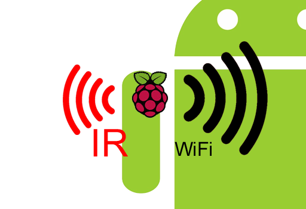
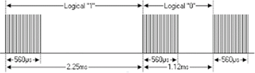

<p align="left">
  
</p>

IR-Bridge Project / RaspberryPi
================================

A daemon TCP server to offer a raw Infrared to TCP bridge

Tested on Raspberry PI model B Rev2,  Distrib: [raspdebian](https://www.raspberrypi.org/downloads/) 3.12.35

Abstract
========

Comming from the idea of connecting an Infrared [StartFrit scale](https://www.starfrit.com/en/electronic-scale-with-remote-3)
to my smartphone (or even a cloud service), I decide to create this little project to have a full raw bridge between wifi and infrared.

Obvisouly a lot of similar projects are available on the net, but here the key-features are:
* A fully bi-directional IR to TCP bridge where others are mostly focused on one way.
* Full infrared's waveforms are bridged to allow clients to implement various proprietary IR protocols.
* A cross platform (Android, Linux, Windows) 'ircodec' library makes the job easier to deal with these raw's waveforms

At the really beginning of this project I start with NEC protocol (waveform below), which is one of the very common infrared protocol used for remotes.
Consequently this project provides a way to do a universal remote or... maybe make a first low-cost step into the domotic world.
<p align="center">
  
</p>

In a second step, I've reverse-engineered my starfrit scale which use a proprietary IR protocols.
This part is referenced as 'unkn0' protocol in the 'ircodec' sources.

History
=======

2015/07 : Jan dOrgeville - first issue

Prequists
================
This project is based on lirc for linux, so you need to install the package with the following line
```
sudo apt-get install lirc
```
Then add the following line in /etc/modules (depending on your GPIO setup)
```
lirc_dev
lirc_rpi gpio_in_pin=23 gpio_out_pin=22
```

more information here: http://alexba.in/blog/2013/01/06/setting-up-lirc-on-the-raspberrypi/  
lirc sources before raspberry patches: http://lirc.sourceforge.net/ 
	

Installation :
==============

Once your lirc is fully functional, remove the default lirc daemon start script
```
sudo mv /etc/init.d/lirc ~ 
```
Then compile IRBridge with:
```
cd raspberrypi/irbrgd
make && sudo ./setup.sh
```
See self explained configuration file lays here
```
/etc/irbrgd/irbrgd.conf
```
To manually stop the daemon:
```
sudo irbrgd stop
```

Clients :
=========

2 samples clients are provided:

**clients/android**

A very basic android sample project (Tuned for Eclipse)


**clients/linux**

A regular TCP client which also shows the measured weight and provides the following commands:
```
h - help
q - quit
1 - send light ON
2 - send light OFF
3 - send 88.3Kg
```

Folders Layout:
===============

* raspberrypi/ir-test0 : really first test with lirc driver, it shows pulse/space waveform when an infrared activity is detected
* raspberrypi/ir-test1 : show NEC code when a NEC-based remote is used
* raspberrypi/ir-test2 : show/send NEC code when user press a key (see main.c)
* raspberrypi/ir-test3 : same as ir-test2 but with a starfrit Scale 39bits proprietary IR protocol
* raspberrypi/server   : a first version of a TCP/IR bridge
* raspberrypi/irbrgd   : the final project which is basically the daemon version of the previous project
* raspberrypi/docs     : docs about starfrit revert engineering
* raspberrypi/clients  : clients samples
* raspberrypi/ircodec  : cross platform library for raw IR waveforms coding/decoding

License :
========

This program is free software: you can redistribute it and/or modify
it under the terms of the GNU General Public License as published by
the Free Software Foundation, either version 3 of the License, or
(at your option) any later version.

This program is distributed in the hope that it will be useful,
but WITHOUT ANY WARRANTY; without even the implied warranty of
MERCHANTABILITY or FITNESS FOR A PARTICULAR PURPOSE.  See the
GNU General Public License for more details.

You should have received a copy of the GNU General Public License
along with this program.  If not, see <http://www.gnu.org/licenses/>.

